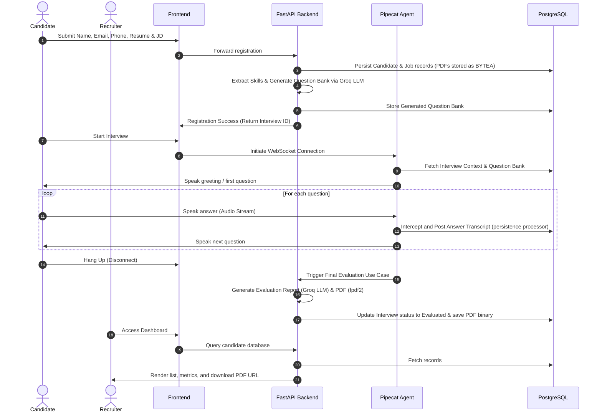
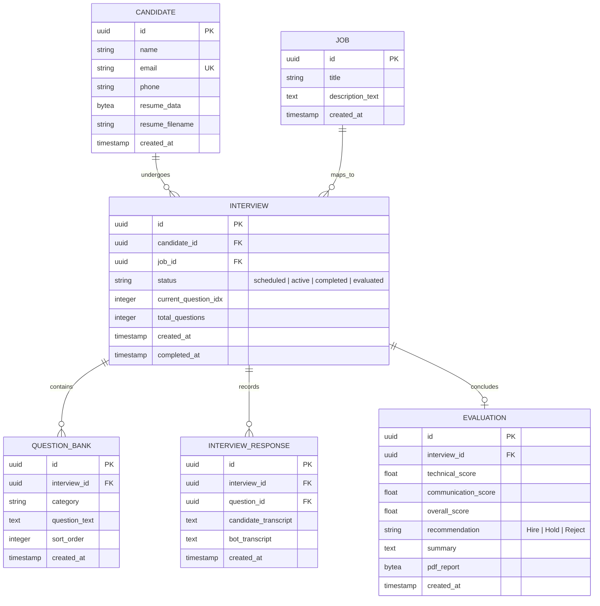

# HR Voice + Vision Interview Platform — Architecture & System Design

This document details the production-ready architecture design and system specifications for the **HR Voice + Vision Interview Agent** platform. It has been compiled in accordance with the STRICT OPERATING RULES defined in `PRD.md`.

---

## 1. Requirement Review

The target system is an AI-powered interview platform that conducts automated candidate evaluations using real-time voice analysis.

### Core Functional Flow


### Key Metrics & SLAs
*   **Response Latency**: Voice turn-around time (silence detection to start of AI audio playback) must be **< 1.0 second**.
*   **Scale**: Designed to handle **10,000+** concurrent active interviews.
*   **Data Isolation**: All candidate PII, resumes, and PDFs are securely stored locally within PostgreSQL.

---

## 2. Clarifying Questions & Architecture Assumptions

### Q1: Candidate-to-Job Cardinality
*   *Strategy*: We design a **1-to-Many relationship** between Candidate and Interviews. A candidate profile is unique by email, but they can have multiple `Interview` instances (each mapped to a specific Job ID).

### Q2: Vision Analytics Data Ingestion
*   *Strategy*: For the MVP, Vision Analytics is deferred to a future phase. The current platform strictly focuses on high-fidelity Voice and Transcription gathering.

### Q3: File Storage Strategy (No S3/Redis)
*   *Strategy*: To optimize for immediate local deployment on Windows without complex Docker volumes or cloud storage, **PostgreSQL `BYTEA` columns** natively store both the input Resume PDFs and the generated Evaluation PDFs. State tracking (current question index) is also handled directly by PostgreSQL, entirely eliminating the need for Redis and Amazon S3.

---

## 3. Microservice Breakdown

The platform is divided into specialized layers that share a single robust PostgreSQL database:

```
          ┌────────────────────┼────────────────────┐
          ▼                    ▼                    ▼
 ┌─────────────────┐  ┌─────────────────┐  ┌─────────────────┐
 │  Core Backend   │  │ Pipecat Worker  │  │ React Frontend  │
 │    (FastAPI)    │  │  (Voice Agent)  │  │  (Vite App)     │
 └────────┬────────┘  └────────┬────────┘  └────────┬────────┘
          │                    │                    │
          └──────────┐         │         ┌──────────┘
                     ▼         ▼         ▼
                ┌────────────────────────┐
                │  Shared Storage/State  │
                │     (PostgreSQL)       │
                └────────────────────────┘
```

---

## 4. Database Design (PostgreSQL)

We use PostgreSQL as the sole source of truth for both relational mapping and blob storage.

### ER Diagram



---

## 5. Security Review

*   **Data Masking**: Candidate PDFs and Evaluation PDFs are kept entirely out of the public filesystem, stored safely as byte binaries inside the database.
*   **Decoupled Voice**: The Pipecat voice pipeline receives instructions from the Database, completely insulating the LLM logic from frontend manipulation.

---

## 6. Folder Structure (Clean Architecture)

```
pipecat/
├── PRD.md
├── architecture.md
├── requirements.txt
├── bot.py
├── frontend/                  # React + Vite Application
│   ├── index.css
│   └── src/pages/
├── src/
│   ├── config.py
│   ├── pipeline.py
│   ├── application/             # Business Logic & Orchestrators
│   │   ├── schemas.py
│   │   └── use_cases/
│   │       ├── register_candidate.py
│   │       ├── generate_questions.py
│   │       └── evaluate_interview.py
│   ├── infrastructure/          # Data Adapters & Outer Layers
│   │   └── db/
│   │       ├── database.py
│   │       ├── models.py
│   │       └── repository.py
│   ├── interface/               # Routers, Controllers, API Spec
│   │   ├── api/
│   │   │   ├── router.py
│   │   │   └── candidate_handler.py
│   │   └── pipecat/
│   │       └── persistence.py
│   └── utils/
│       └── pdf_generator.py
```
